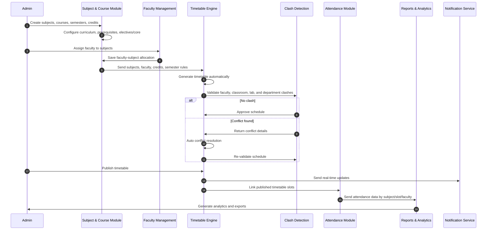

# ERP System Architecture - Attendance, Subject/Course & Timetable Integration

This architecture extends the existing Attendance ERP flow with two advanced academic core modules:

- **Subject & Course Management Module**
- **Timetable Management Module**

The design keeps the ERP-style layered architecture: admin operations, academic configuration, automation engine, attendance linkage, dashboards, notifications, analytics, and persistent database storage.

---

## Enterprise Architecture Diagram

```mermaid
flowchart TB
    %% ===== Theme =====
    classDef user fill:#E8F1FF,stroke:#2563EB,stroke-width:1.5px,color:#0F172A
    classDef core fill:#EFF6FF,stroke:#1D4ED8,stroke-width:2px,color:#0F172A
    classDef subject fill:#ECFDF5,stroke:#059669,stroke-width:2px,color:#064E3B
    classDef timetable fill:#FFF7ED,stroke:#EA580C,stroke-width:2px,color:#7C2D12
    classDef engine fill:#F5F3FF,stroke:#7C3AED,stroke-width:2px,color:#2E1065
    classDef integration fill:#F8FAFC,stroke:#475569,stroke-width:1.5px,color:#0F172A
    classDef database fill:#FEF2F2,stroke:#DC2626,stroke-width:1.5px,color:#7F1D1D
    classDef output fill:#F0FDFA,stroke:#0D9488,stroke-width:1.5px,color:#134E4A

    %% ===== Users =====
    subgraph U["User & Access Layer"]
        ADMIN["Admin / Academic Coordinator"]
        FACULTY["Faculty Portal"]
        STUDENT["Student Portal"]
        MOBILE["Mobile App"]
    end

    %% ===== Existing ERP Core =====
    subgraph CORE["Existing ERP Core Platform"]
        AUTH["Authentication & Role Permissions"]
        FACULTY_MGMT["Faculty Management"]
        STUDENT_ENROLL["Student Enrollment"]
        ATTENDANCE["Attendance Module"]
        NOTIFY["Notification Service"]
        REPORTS["Reports & Analytics"]
    end

    %% ===== Subject & Course Management =====
    subgraph SCM["Subject & Course Management Module"]
        SUBJECT_CREATE["Subject Creation & Management"]
        COURSE_MAP["Course Mapping"]
        SEM_ALLOC["Semester-wise Subject Allocation"]
        CREDIT_MGMT["Credit System Management"]
        CURRICULUM["Curriculum Planning"]
        PREREQ["Subject Prerequisites"]
        ELECTIVE_CORE["Elective & Core Subject Handling"]
        DEPT_STRUCTURE["Department-wise Course Structure"]
        FAC_SUBJECT["Faculty Subject Assignment"]
        YEAR_CONFIG["Academic Year Configuration"]
        SYLLABUS["Syllabus Upload & Tracking"]
        SUBJECT_STATUS["Subject Status: Active / Inactive"]
    end

    %% ===== Timetable Management =====
    subgraph TTM["Timetable Management Module"]
        SMART_GEN["Smart Timetable Generator"]
        DRAG_DROP["Drag & Drop Timetable UI"]
        AVAILABILITY["Faculty Availability Check"]
        CLASSROOM["Classroom Allocation"]
        CLASH["Clash Detection"]
        AUTO_RESOLVE["Auto Conflict Resolution"]
        LAB_SCHED["Lab Session Scheduling"]
        MULTI_DEPT["Multi-Department Scheduling"]
        PERIOD_ALLOC["Subject Period Allocation"]
        BREAKS["Break & Lunch Configuration"]
        VIEWS["Weekly / Monthly View"]
        PUBLISH["Publish Timetable"]
        REALTIME["Real-time Timetable Updates"]
    end

    %% ===== Timetable Engine =====
    subgraph ENGINE["Scheduling & Validation Engine"]
        RULES["Academic Rules Engine"]
        CONSTRAINTS["Constraint Solver"]
        VALIDATOR["Clash Validation Service"]
        LINKER["Attendance-Timetable Linker"]
    end

    %% ===== Database =====
    subgraph DB["ERP Database Layer"]
        DB_SUBJECTS[("subjects")]
        DB_COURSES[("courses")]
        DB_CURRICULUM[("curriculum")]
        DB_SEMESTERS[("semesters")]
        DB_CREDITS[("credits")]
        DB_SUBJECT_ALLOC[("subject_allocation")]
        DB_TIMETABLE[("timetable")]
        DB_CLASSROOMS[("classrooms")]
        DB_FAC_SCHEDULE[("faculty_schedule")]
        DB_LECTURE_SLOTS[("lecture_slots")]
        DB_ROOM_ALLOC[("room_allocation")]
        DB_ATTENDANCE[("attendance_records")]
    end

    %% ===== Output Channels =====
    subgraph OUT["Publishing & Consumption Layer"]
        STUDENT_DASH["Student Dashboard"]
        FACULTY_DASH["Faculty Dashboard"]
        ADMIN_REPORT["Admin Analytics Dashboard"]
        EXPORTS["PDF / Excel / Reports"]
    end

    %% ===== Main Flow =====
    ADMIN --> AUTH
    AUTH --> SUBJECT_CREATE
    AUTH --> SMART_GEN

    SUBJECT_CREATE --> COURSE_MAP --> SEM_ALLOC --> CREDIT_MGMT --> CURRICULUM
    CURRICULUM --> PREREQ
    CURRICULUM --> ELECTIVE_CORE
    CURRICULUM --> DEPT_STRUCTURE
    DEPT_STRUCTURE --> FAC_SUBJECT
    YEAR_CONFIG --> SEM_ALLOC
    SYLLABUS --> SUBJECT_CREATE
    SUBJECT_STATUS --> SUBJECT_CREATE

    FACULTY_MGMT --> FAC_SUBJECT
    STUDENT_ENROLL --> COURSE_MAP
    FAC_SUBJECT --> SMART_GEN
    SEM_ALLOC --> PERIOD_ALLOC

    SMART_GEN --> RULES --> CONSTRAINTS --> AVAILABILITY
    AVAILABILITY --> CLASSROOM --> CLASH --> VALIDATOR
    VALIDATOR -->|No Clash| PUBLISH
    VALIDATOR -->|Conflict Found| AUTO_RESOLVE --> CONSTRAINTS
    LAB_SCHED --> CONSTRAINTS
    MULTI_DEPT --> CONSTRAINTS
    BREAKS --> CONSTRAINTS
    DRAG_DROP --> CLASH
    PERIOD_ALLOC --> SMART_GEN
    PUBLISH --> REALTIME
    REALTIME --> VIEWS

    PUBLISH --> LINKER --> ATTENDANCE
    ATTENDANCE --> REPORTS
    REPORTS --> ADMIN_REPORT
    PUBLISH --> NOTIFY
    NOTIFY --> STUDENT_DASH
    NOTIFY --> FACULTY_DASH
    NOTIFY --> MOBILE
    STUDENT --> STUDENT_DASH
    FACULTY --> FACULTY_DASH
    ADMIN --> ADMIN_REPORT
    REPORTS --> EXPORTS

    %% ===== Data Flow =====
    SUBJECT_CREATE --> DB_SUBJECTS
    COURSE_MAP --> DB_COURSES
    CURRICULUM --> DB_CURRICULUM
    SEM_ALLOC --> DB_SEMESTERS
    CREDIT_MGMT --> DB_CREDITS
    FAC_SUBJECT --> DB_SUBJECT_ALLOC
    SMART_GEN --> DB_TIMETABLE
    CLASSROOM --> DB_CLASSROOMS
    AVAILABILITY --> DB_FAC_SCHEDULE
    PERIOD_ALLOC --> DB_LECTURE_SLOTS
    CLASSROOM --> DB_ROOM_ALLOC
    ATTENDANCE --> DB_ATTENDANCE

    DB_SUBJECTS --> SMART_GEN
    DB_COURSES --> SMART_GEN
    DB_SUBJECT_ALLOC --> SMART_GEN
    DB_CLASSROOMS --> CLASSROOM
    DB_FAC_SCHEDULE --> AVAILABILITY
    DB_TIMETABLE --> VIEWS
    DB_TIMETABLE --> ATTENDANCE

    %% ===== Styling =====
    class ADMIN,FACULTY,STUDENT,MOBILE user
    class AUTH,FACULTY_MGMT,STUDENT_ENROLL,ATTENDANCE,NOTIFY,REPORTS core
    class SUBJECT_CREATE,COURSE_MAP,SEM_ALLOC,CREDIT_MGMT,CURRICULUM,PREREQ,ELECTIVE_CORE,DEPT_STRUCTURE,FAC_SUBJECT,YEAR_CONFIG,SYLLABUS,SUBJECT_STATUS subject
    class SMART_GEN,DRAG_DROP,AVAILABILITY,CLASSROOM,CLASH,AUTO_RESOLVE,LAB_SCHED,MULTI_DEPT,PERIOD_ALLOC,BREAKS,VIEWS,PUBLISH,REALTIME timetable
    class RULES,CONSTRAINTS,VALIDATOR,LINKER engine
    class DB_SUBJECTS,DB_COURSES,DB_CURRICULUM,DB_SEMESTERS,DB_CREDITS,DB_SUBJECT_ALLOC,DB_TIMETABLE,DB_CLASSROOMS,DB_FAC_SCHEDULE,DB_LECTURE_SLOTS,DB_ROOM_ALLOC,DB_ATTENDANCE database
    class STUDENT_DASH,FACULTY_DASH,ADMIN_REPORT,EXPORTS output
```

---

## Subject & Course Management Module

### Core Capabilities

| Feature | Enterprise Function |
|---|---|
| Subject Creation & Management | Create subject master records with code, name, department, type, and status |
| Course Mapping | Map subjects to courses, departments, programs, and academic structures |
| Semester-wise Subject Allocation | Assign subjects to specific semesters and academic years |
| Credit System Management | Define lecture, tutorial, practical, and total credit rules |
| Curriculum Planning | Maintain structured curriculum plans per course and semester |
| Subject Prerequisites | Define dependency rules before a subject can be allocated |
| Elective & Core Subject Handling | Separate mandatory core subjects from elective baskets |
| Department-wise Course Structure | Maintain department-specific course catalogs |
| Faculty Subject Assignment | Assign eligible faculty to subjects based on department and load |
| Academic Year Configuration | Configure yearly curriculum versions and active academic cycles |
| Syllabus Upload & Tracking | Upload syllabus files and track coverage/progress |
| Subject Status | Activate or deactivate subjects without deleting historical records |

### Database Tables

| Table | Purpose |
|---|---|
| `subjects` | Stores subject master data, codes, names, type, status, and department linkage |
| `courses` | Stores course/program information and department ownership |
| `curriculum` | Stores course curriculum plans and academic year versions |
| `semesters` | Stores semester structures and ordering |
| `credits` | Stores credit configuration for theory, practical, lab, and total credits |
| `subject_allocation` | Maps subjects to semesters, faculty, departments, and academic years |

### Integrations

- **Faculty Management:** validates faculty eligibility and subject assignment.
- **Student Enrollment:** aligns enrolled students with course/semester subject structure.
- **Reports & Analytics:** provides subject load, credit distribution, and curriculum reports.
- **Timetable Engine:** supplies subjects, periods, faculty mapping, and allocation rules.

---

## Timetable Management Module

### Core Capabilities

| Feature | Enterprise Function |
|---|---|
| Smart Timetable Generator | Auto-generates timetable using subjects, faculty, rooms, and constraints |
| Drag & Drop Timetable UI | Allows manual timetable adjustment with instant validation |
| Faculty Availability Check | Prevents allocation outside available faculty slots |
| Classroom Allocation | Assigns classrooms and labs based on capacity and availability |
| Clash Detection | Detects faculty, classroom, section, subject, and department conflicts |
| Auto Conflict Resolution | Re-optimizes conflicted slots using rule-based alternatives |
| Lab Session Scheduling | Handles continuous lab blocks and room-specific scheduling |
| Multi-Department Scheduling | Coordinates shared faculty and classroom usage across departments |
| Subject Period Allocation | Distributes subject periods according to credit and curriculum rules |
| Break & Lunch Configuration | Reserves break slots across daily/weekly schedules |
| Weekly / Monthly Timetable View | Provides operational calendar views for admins, faculty, and students |
| Publish Timetable | Locks validated schedules and releases them to dashboards/mobile app |
| Real-time Timetable Updates | Pushes timetable changes to dependent users and attendance workflows |

### Database Tables

| Table | Purpose |
|---|---|
| `timetable` | Stores final and draft timetable records |
| `classrooms` | Stores room/lab capacity, type, and availability metadata |
| `faculty_schedule` | Stores faculty availability, workload, and assigned slots |
| `lecture_slots` | Stores period slots, day configuration, breaks, and lunch timings |
| `room_allocation` | Stores classroom/lab assignment per timetable slot |

### Integrations

- **Attendance Module:** binds attendance sessions to published timetable slots.
- **Notification Service:** alerts students/faculty on publish and real-time changes.
- **Student Dashboard:** shows student-specific timetable and attendance schedule.
- **Faculty Dashboard:** shows teaching load, classes, rooms, and attendance actions.
- **Mobile App:** provides live timetable access and change notifications.

---

## End-to-End Workflow

---

## Workflow Summary

1. **Admin creates subjects & courses** with semester, credit, curriculum, prerequisite, elective/core, academic year, and syllabus details.
2. **Faculty assigned to subjects** based on department, eligibility, availability, and workload.
3. **Timetable generated automatically** using subjects, credits, lecture slots, classrooms, labs, breaks, and faculty schedules.
4. **Clash detection validation** checks faculty, classroom, lab, section, department, and subject-period conflicts.
5. **Timetable published** after successful validation or auto conflict resolution.
6. **Attendance linked with timetable** so each attendance session is mapped to subject, slot, faculty, room, and student group.
7. **Reports & analytics generated** for timetable usage, attendance trends, subject coverage, faculty load, and department performance.

